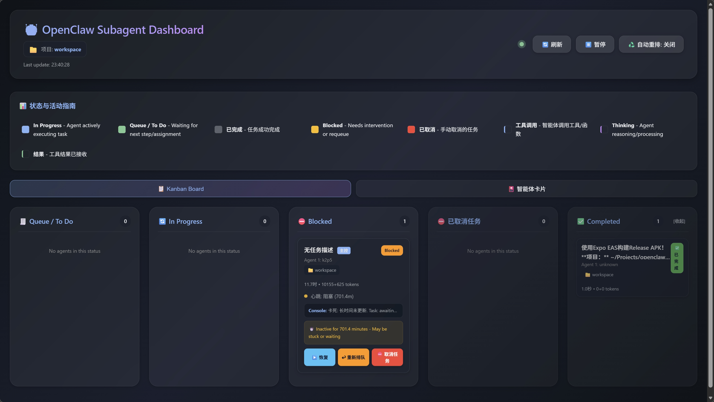

# OpenClaw 智能体监控面板 (中文版)

OpenClaw 子代理的实时监控 Web 面板。查看活跃智能体、进度、对话记录，并管理卡死的会话。



## 功能特性

- **实时监控** - 每3秒自动刷新
- **智能体卡片** - 查看模型、运行时间、Token 使用量和任务进度
- **对话记录查看** - 查看每个智能体的最近活动
- **卡死检测** - 高亮显示超过30分钟无活动的智能体
- **刷新控制** - 手动刷新和重启选项

## 快速开始

```bash
cd workspace/skills/subagent-dashboard/scripts
./start_dashboard.sh
```

然后在浏览器中打开 http://localhost:8080

## 手动启动

```bash
cd workspace/skills/subagent-dashboard/scripts
python3 -m venv venv
source venv/bin/activate
pip install -r ../requirements.txt
python3 dashboard.py
```

## 使用方法

面板会自动显示过去60分钟内活跃的所有子代理。每张卡片显示：

- **智能体编号** 和模型
- **运行时间** - 智能体已运行多长时间
- **Token 使用量** - 输入和输出 Token
- **任务进度** - 如果可用 (任务 X/Y)
- **任务描述** - 智能体正在处理的内容

### 操作按钮

- **📋 对话记录** - 查看智能体的最近活动/事件
- **🔄 刷新** - 刷新智能体状态
- **⚡ 重启** - 重启卡死的智能体 (需要网关访问)
- **▶️ 恢复** - 恢复卡死的任务
- **⛔ 取消任务** - 取消正在运行的任务

### 自动刷新

面板每3秒自动刷新。点击"暂停"停止自动刷新，或点击"继续"重新开始。

### 自动重排

启用后，面板会自动尝试恢复卡死的智能体。

## API 端点

- `GET /api/subagents` - 列出所有活跃子代理
- `GET /api/subagent/<session_id>/status` - 获取详细状态
- `GET /api/subagent/<session_id>/transcript?lines=N` - 获取对话记录 (默认50行)
- `POST /api/subagent/<session_id>/refresh` - 请求刷新/重启
- `GET /api/stalled` - 获取卡死代理列表
- `GET /api/project` - 获取当前项目信息

## 系统要求

- Python 3.7+
- Flask 和 flask-cors (通过 requirements.txt 安装)
- 访问 OpenClaw 会话文件 (`~/.openclaw/agents/main/sessions/`)
- 已安装 subagent-tracker skill

## 智能体未显示？

面板从 `OPENCLAW_HOME/agents/main/sessions/sessions.json` (默认 `~/.openclaw`) 读取。如果您看不到生成的子代理：

1. **相同的 OpenClaw 主目录** – 使用与您的 TUI/网关相同的 `OPENCLAW_HOME` 启动面板。示例：`OPENCLAW_HOME=/path/to/.openclaw ./scripts/start_dashboard.sh`
2. **网关写入会话** – 只有在网关在 `sessions.json` 中注册后，子代理才会出现。如果 TUI 在其他地方运行（例如不同的机器或沙箱），该网关可能会写入不同的路径；启动面板时将 `OPENCLAW_HOME` 指向该路径。

## 端口

默认端口为 8080 (避免与 macOS AirPlay 接收器在 5000 端口冲突)。设置 `PORT` 环境变量以更改：

```bash
PORT=5000 python3 dashboard.py
```

## 中文翻译说明

本项目已完全中文化，包括：
- 界面标签和按钮
- 状态提示和错误消息
- 代码注释和文档字符串
- API 响应消息

## 截图预览


*看板视图显示智能体的不同状态：进行中、队列、阻塞、已完成、已取消*

## 许可证

MIT License - 与 OpenClaw 项目兼容
